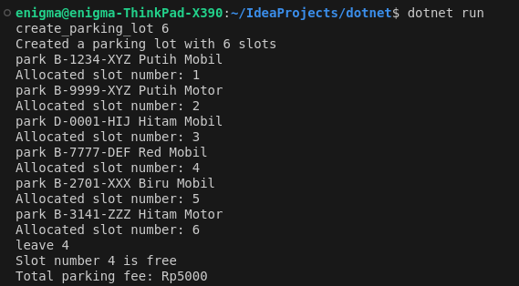
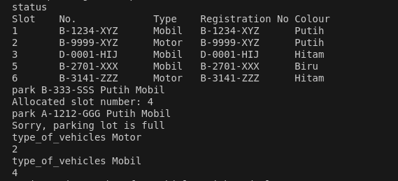
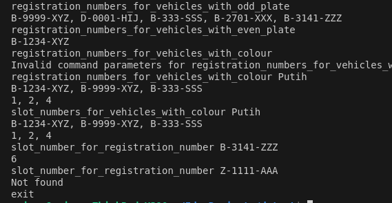

The program uses .Net 8 so make sure you have installed the appropriate version for this program.
To run the program, type the command `dotnet run`.
Then start by entering commands such as `create_parking_lot 6`.
Note: the number you enter can be any value you like.
If the program is successful, it will appear as shown in the image below.

You can continue running the program by following the commands shown in the following image.

You can close the program using the command `exit`.